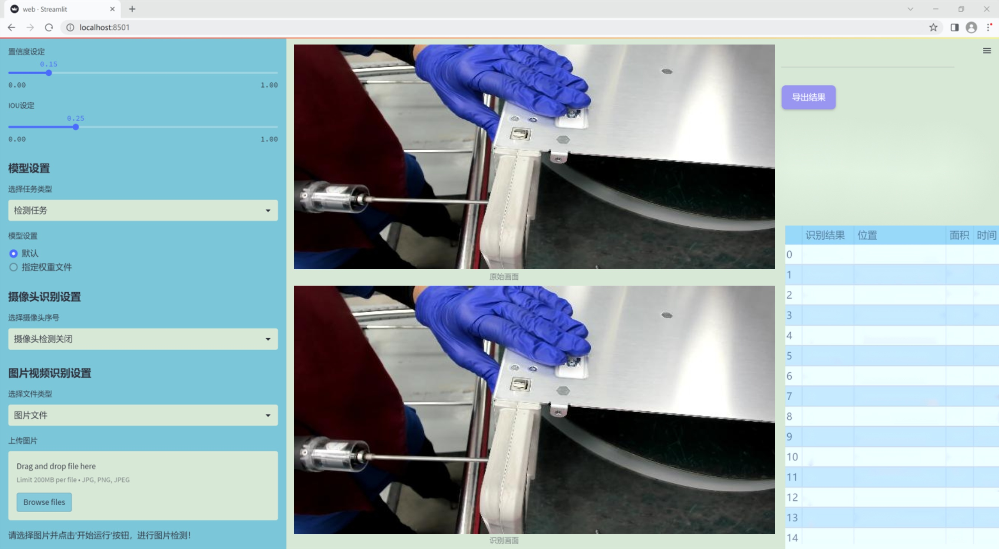
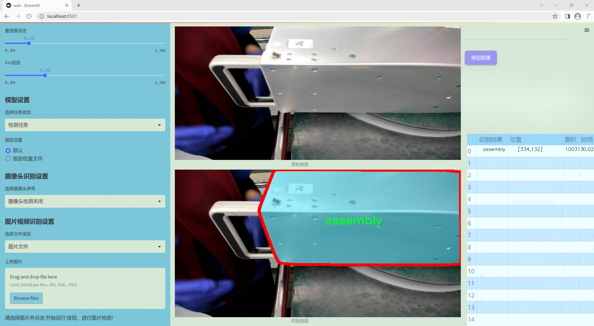
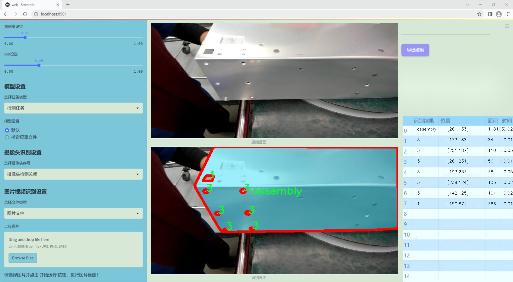
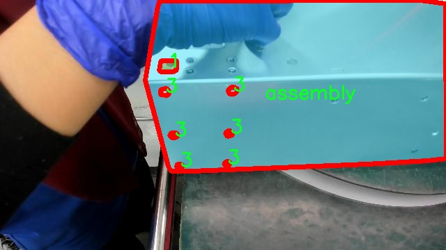
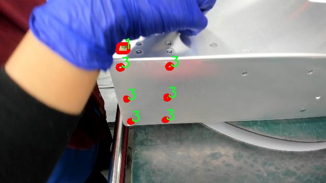
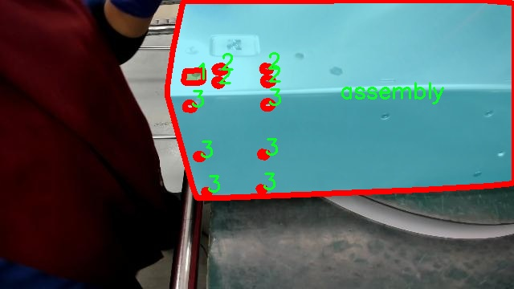
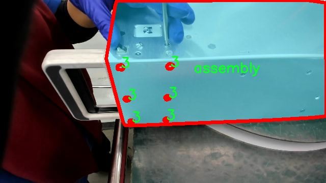
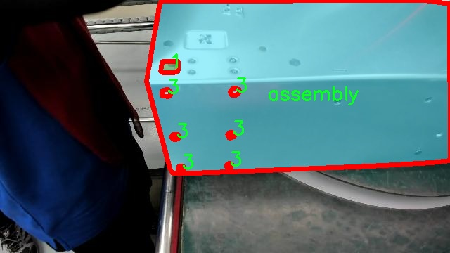

### 1.背景意义

研究背景与意义

在现代制造业中，工件的精确定位与装配是确保产品质量和生产效率的关键环节。随着工业自动化和智能制造的快速发展，传统的人工检测和定位方法已逐渐无法满足高效、准确的生产需求。因此，基于计算机视觉的自动化定位技术应运而生，成为提升生产效率和降低人力成本的重要手段。尤其是在复杂的工件结构中，螺孔的定位和识别显得尤为重要。螺孔的精确定位不仅影响装配的准确性，还直接关系到产品的整体性能和安全性。

在这一背景下，基于改进YOLOv11的工件螺孔定位实例分割系统的研究具有重要的理论与实际意义。YOLO（You Only Look Once）系列模型以其高效的实时检测能力和较高的准确率，成为计算机视觉领域的热门选择。通过对YOLOv11进行改进，结合实例分割技术，可以实现对工件螺孔的精确定位与分割，进而提高工件装配的自动化水平。

本研究所使用的数据集包含3100张图像，涵盖了四个类别的工件特征，分别为‘1’、‘2’、‘3’和‘assembly’。这些类别的多样性为模型的训练提供了丰富的样本，有助于提升模型的泛化能力和鲁棒性。通过对这些图像进行YOLOv8格式的标注，研究者能够有效地利用现有的计算机视觉技术，推动螺孔定位的智能化进程。

总之，基于改进YOLOv11的工件螺孔定位实例分割系统不仅能够提高工件装配的自动化程度，还为智能制造领域提供了新的解决方案，具有广泛的应用前景和深远的影响。通过这一研究，期望能够为制造业的数字化转型贡献力量，推动行业的技术进步与创新发展。

### 2.视频效果

[2.1 视频效果](https://www.bilibili.com/video/BV17xkCYPEde/)

### 3.图片效果







##### [项目涉及的源码数据来源链接](https://kdocs.cn/l/cszuIiCKVNis)**

注意：本项目提供训练的数据集和训练教程,由于版本持续更新,暂不提供权重文件（best.pt）,请按照6.训练教程进行训练后实现上图演示的效果。

### 4.数据集信息

##### 4.1 本项目数据集类别数＆类别名

nc: 4
names: ['1', '2', '3', 'assembly']


该项目为【图像分割】数据集，请在【训练教程和Web端加载模型教程（第三步）】这一步的时候按照【图像分割】部分的教程来训练

##### 4.2 本项目数据集信息介绍

本项目数据集信息介绍

本项目所使用的数据集旨在支持改进YOLOv11的工件螺孔定位实例分割系统的训练与评估。该数据集围绕“S4BLS-addon”主题构建，专注于工业制造领域中螺孔的检测与定位，尤其是在装配过程中的应用。数据集中包含四个主要类别，分别为“1”、“2”、“3”和“assembly”，这些类别代表了不同类型的螺孔及其在工件装配中的角色。

在数据集的构建过程中，特别注重了数据的多样性与代表性，以确保模型能够在各种实际应用场景中表现出色。类别“1”、“2”和“3”分别对应不同直径和形状的螺孔，这些螺孔在工业产品的装配中扮演着关键角色。通过对这些类别的精确标注，数据集为模型提供了丰富的训练样本，使其能够学习到不同螺孔的特征和定位技巧。

此外，类别“assembly”则代表了螺孔在实际装配过程中的上下文信息，旨在帮助模型理解螺孔与周围组件之间的关系。这一类别的引入，不仅丰富了数据集的内容，也提升了模型在复杂场景下的识别能力。

为了确保数据集的高质量，所有样本均经过严格的筛选和标注，保证了标注的准确性和一致性。数据集的规模和多样性为YOLOv11模型的训练提供了坚实的基础，使其能够在实际应用中实现高效的螺孔定位与实例分割。通过这一数据集的支持，项目旨在推动工件螺孔检测技术的发展，提升工业自动化的效率与精度。











### 5.全套项目环境部署视频教程（零基础手把手教学）

[5.1 所需软件PyCharm和Anaconda安装教程（第一步）](https://www.bilibili.com/video/BV1BoC1YCEKi/?spm_id_from=333.999.0.0&vd_source=bc9aec86d164b67a7004b996143742dc)


[5.2 安装Python虚拟环境创建和依赖库安装视频教程（第二步）](https://www.bilibili.com/video/BV1ZoC1YCEBw?spm_id_from=333.788.videopod.sections&vd_source=bc9aec86d164b67a7004b996143742dc)

### 6.改进YOLOv11训练教程和Web_UI前端加载模型教程（零基础手把手教学）

[6.1 改进YOLOv11训练教程和Web_UI前端加载模型教程（第三步）](https://www.bilibili.com/video/BV1BoC1YCEhR?spm_id_from=333.788.videopod.sections&vd_source=bc9aec86d164b67a7004b996143742dc)


按照上面的训练视频教程链接加载项目提供的数据集，运行train.py即可开始训练



     Epoch   gpu_mem       box       obj       cls    labels  img_size
     1/200     20.8G   0.01576   0.01955  0.007536        22      1280: 100%|██████████| 849/849 [14:42<00:00,  1.04s/it]
               Class     Images     Labels          P          R     mAP@.5 mAP@.5:.95: 100%|██████████| 213/213 [01:14<00:00,  2.87it/s]
                 all       3395      17314      0.994      0.957      0.0957      0.0843

     Epoch   gpu_mem       box       obj       cls    labels  img_size
     2/200     20.8G   0.01578   0.01923  0.007006        22      1280: 100%|██████████| 849/849 [14:44<00:00,  1.04s/it]
               Class     Images     Labels          P          R     mAP@.5 mAP@.5:.95: 100%|██████████| 213/213 [01:12<00:00,  2.95it/s]
                 all       3395      17314      0.996      0.956      0.0957      0.0845

     Epoch   gpu_mem       box       obj       cls    labels  img_size
     3/200     20.8G   0.01561    0.0191  0.006895        27      1280: 100%|██████████| 849/849 [10:56<00:00,  1.29it/s]
               Class     Images     Labels          P          R     mAP@.5 mAP@.5:.95: 100%|███████   | 187/213 [00:52<00:00,  4.04it/s]
                 all       3395      17314      0.996      0.957      0.0957      0.0845


###### [项目数据集下载链接](https://kdocs.cn/l/cszuIiCKVNis)

### 7.原始YOLOv11算法讲解


YOLO11 是 Ultralytics YOLO 系列的最新版本，结合了尖端的准确性、速度和效率，用于目标检测、分割、分类、定向边界框和姿态估计。与
YOLOv8 相比，它具有更少的参数和更好的结果，不难预见，YOLO11 在边缘设备上更高效、更快，将频繁出现在计算机视觉领域的最先进技术（SOTA）中。


**主要特点**

  * **增强的特征提取：**YOLO11 使用改进的主干和颈部架构来增强特征提取，以实现更精确的目标检测和复杂任务的性能。

  * **针对效率和速度优化：**精细的架构设计和优化的训练流程在保持准确性和性能之间最佳平衡的同时，提供更快的处理速度。

  * **更少的参数，更高的准确度：**YOLO11m 在 COCO 数据集上实现了比 YOLOv8m 更高的 mAP，参数减少了 22%，提高了计算效率，同时不牺牲准确度。

  * **跨环境的适应性：**YOLO11 可以无缝部署在边缘设备、云平台和配备 NVIDIA GPU 的系统上，确保最大的灵活性。

  * **支持广泛的任务范围：**YOLO11 支持各种计算机视觉任务，如目标检测、实例分割、图像分类、姿态估计和定向目标检测（OBB）。


### 8.200+种全套改进YOLOV11创新点原理讲解

#### 8.1 200+种全套改进YOLOV11创新点原理讲解大全

由于篇幅限制，每个创新点的具体原理讲解就不全部展开，具体见下列网址中的改进模块对应项目的技术原理博客网址【Blog】（创新点均为模块化搭建，原理适配YOLOv5~YOLOv11等各种版本）

[改进模块技术原理博客【Blog】网址链接](https://gitee.com/qunmasj/good)


#### 8.2 精选部分改进YOLOV11创新点原理讲解

###### 这里节选部分改进创新点展开原理讲解(完整的改进原理见上图和[改进模块技术原理博客链接](https://gitee.com/qunmasj/good)【如果此小节的图加载失败可以通过CSDN或者Github搜索该博客的标题访问原始博客，原始博客图片显示正常】

### RT-DETR骨干网络HGNetv2简介
#### RT-DETR横空出世
前几天被百度的RT-DETR刷屏，参考该博客提出的目标检测新范式对原始DETR的网络结构进行了调整和优化，以提高计算速度和减小模型大小。这包括使用更轻量级的基础网络和调整Transformer结构。并且，摒弃了nms处理的detr结构与传统的物体检测方法相比，不仅训练是端到端的，检测也能端到端，这意味着整个网络在训练过程中一起进行优化，推理过程不需要昂贵的后处理代价，这有助于提高模型的泛化能力和性能。


当然，人们对RT-DETR之所以产生浓厚的兴趣，我觉得大概率还是对YOLO系列审美疲劳了，就算是出到了YOLO10086，我还是只想用YOLOv11和YOLOv11的框架来魔改做业务。。

#### 初识HGNet
看到RT-DETR的性能指标，发现指标最好的两个模型backbone都是用的HGNetv2，毫无疑问，和当时的picodet一样，骨干都是使用百度自家的网络。初识HGNet的时候，当时是参加了第四届百度网盘图像处理大赛，文档图像方向识别专题赛道，简单来说，就是使用分类网络对一些文档截图或者图片进行方向角度分类。


当时的方案并没有那么快定型，通常是打榜过程发现哪个网络性能好就使用哪个网络做魔改，而且木有显卡，只能蹭Ai Studio的平台，不过v100一天8小时的实验时间有点短，这也注定了大模型用不了。 

流水的模型，铁打的炼丹人，最后发现HGNet-tiny各方面指标都很符合我们的预期，后面就一直围绕它魔改。当然，比赛打榜是目的，学习才是享受过程，当时看到效果还可以，便开始折腾起了HGNet的网络架构，我们可以看到，PP-HGNet 针对 GPU 设备，对目前 GPU 友好的网络做了分析和归纳，尽可能多的使用 3x3 标准卷积（计算密度最高），PP-HGNet是由多个HG-Block组成，细节如下：


ConvBNAct是啥？简单聊一聊，就是Conv+BN+Act，CV Man应该最熟悉不过了：
```python
class ConvBNAct(TheseusLayer):
    def __init__(self,
                 in_channels,
                 out_channels,
                 kernel_size,
                 stride,
                 groups=1,
                 use_act=True):
        super().__init__()
        self.use_act = use_act
        self.conv = Conv2D(
            in_channels,
            out_channels,
            kernel_size,
            stride,
            padding=(kernel_size - 1) // 2,
            groups=groups,
            bias_attr=False)
        self.bn = BatchNorm2D(
            out_channels,
            weight_attr=ParamAttr(regularizer=L2Decay(0.0)),
            bias_attr=ParamAttr(regularizer=L2Decay(0.0)))
        if self.use_act:
            self.act = ReLU()
 
    def forward(self, x):
        x = self.conv(x)
        x = self.bn(x)
        if self.use_act:
            x = self.act(x)
        return x 
```
且标准卷积的数量随层数深度增加而增多，从而得到一个有利于 GPU 推理的骨干网络，同样速度下，精度也超越其他 CNN ，性价比也优于ViT-base模型。


另外，我们可以看到：

PP-HGNet 的第一层由channel为96的Stem模块构成，目的是为了减少参数量和计算量。PP-HGNet

Tiny的整体结构由四个HG Stage构成，而每个HG Stage主要由包含大量标准卷积的HG Block构成。

PP-HGNet的第三到第五层使用了使用了可学习的下采样层（LDS Layer），该层group为输入通道数，可达到降参降计算量的作用，且Tiny模型仅包含三个LDS Layer，并不会对GPU的利用率造成较大影响.

PP-HGNet的激活函数为Relu，常数级操作可保证该模型在硬件上的推理速度。

### 9.系统功能展示

图9.1.系统支持检测结果表格显示

  图9.2.系统支持置信度和IOU阈值手动调节

  图9.3.系统支持自定义加载权重文件best.pt(需要你通过步骤5中训练获得)

  图9.4.系统支持摄像头实时识别

  图9.5.系统支持图片识别

  图9.6.系统支持视频识别

  图9.7.系统支持识别结果文件自动保存

  图9.8.系统支持Excel导出检测结果数据


### 10. YOLOv11核心改进源码讲解

#### 10.1 EfficientFormerV2.py

以下是对给定代码的核心部分进行提炼和详细注释的结果。主要保留了模型的定义、前向传播逻辑以及必要的辅助函数。

```python
import torch
import torch.nn as nn
import math
from typing import Dict

# 定义EfficientFormer的宽度和深度
EfficientFormer_width = {
    'L': [40, 80, 192, 384],
    'S2': [32, 64, 144, 288],
    'S1': [32, 48, 120, 224],
    'S0': [32, 48, 96, 176],
}

EfficientFormer_depth = {
    'L': [5, 5, 15, 10],
    'S2': [4, 4, 12, 8],
    'S1': [3, 3, 9, 6],
    'S0': [2, 2, 6, 4],
}

# 定义4D注意力机制
class Attention4D(nn.Module):
    def __init__(self, dim=384, key_dim=32, num_heads=8, attn_ratio=4, resolution=7):
        super().__init__()
        self.num_heads = num_heads
        self.scale = key_dim ** -0.5  # 缩放因子
        self.resolution = resolution
        self.N = resolution ** 2  # 分辨率的平方

        # 定义查询、键、值的卷积层
        self.q = nn.Conv2d(dim, num_heads * key_dim, kernel_size=1)
        self.k = nn.Conv2d(dim, num_heads * key_dim, kernel_size=1)
        self.v = nn.Conv2d(dim, num_heads * attn_ratio * key_dim, kernel_size=1)

        # 注意力偏置参数
        self.attention_biases = nn.Parameter(torch.zeros(num_heads, self.N, self.N))

    def forward(self, x):
        B, C, H, W = x.shape  # 获取输入的维度
        q = self.q(x).view(B, self.num_heads, -1, self.N).permute(0, 1, 3, 2)  # 计算查询
        k = self.k(x).view(B, self.num_heads, -1, self.N).permute(0, 1, 2, 3)  # 计算键
        v = self.v(x).view(B, self.num_heads, -1, self.N).permute(0, 1, 3, 2)  # 计算值

        # 计算注意力权重
        attn = (q @ k) * self.scale + self.attention_biases
        attn = attn.softmax(dim=-1)  # 归一化为概率分布

        # 应用注意力权重
        x = (attn @ v).permute(0, 1, 3, 2).reshape(B, -1, self.resolution, self.resolution)
        return x

# 定义多层感知机（MLP）
class Mlp(nn.Module):
    def __init__(self, in_features, hidden_features=None, out_features=None):
        super().__init__()
        hidden_features = hidden_features or in_features
        self.fc1 = nn.Conv2d(in_features, hidden_features, kernel_size=1)
        self.fc2 = nn.Conv2d(hidden_features, out_features or in_features, kernel_size=1)

    def forward(self, x):
        x = self.fc1(x)
        x = torch.relu(x)  # 激活函数
        x = self.fc2(x)
        return x

# 定义EfficientFormerV2模型
class EfficientFormerV2(nn.Module):
    def __init__(self, layers, embed_dims):
        super().__init__()
        self.patch_embed = nn.Conv2d(3, embed_dims[0], kernel_size=3, stride=2, padding=1)  # 输入层

        # 构建网络
        self.network = nn.ModuleList()
        for i in range(len(layers)):
            self.network.append(Attention4D(dim=embed_dims[i]))  # 添加注意力层
            if i < len(layers) - 1:
                self.network.append(nn.Conv2d(embed_dims[i], embed_dims[i + 1], kernel_size=3, stride=2, padding=1))  # 下采样

    def forward(self, x):
        x = self.patch_embed(x)  # 输入层
        for block in self.network:
            x = block(x)  # 前向传播
        return x

# 定义模型构建函数
def efficientformerv2_s0():
    model = EfficientFormerV2(
        layers=EfficientFormer_depth['S0'],
        embed_dims=EfficientFormer_width['S0']
    )
    return model

# 测试模型
if __name__ == '__main__':
    inputs = torch.randn((1, 3, 640, 640))  # 随机输入
    model = efficientformerv2_s0()  # 创建模型
    res = model(inputs)  # 前向传播
    print(res.size())  # 输出结果的尺寸
```

### 代码说明：
1. **Attention4D**: 实现了一个4D注意力机制，包含查询、键、值的计算以及注意力权重的生成。
2. **Mlp**: 定义了一个简单的多层感知机，用于特征转换。
3. **EfficientFormerV2**: 主要模型类，负责构建网络结构，包括输入层和多个注意力层。
4. **efficientformerv2_s0**: 模型构建函数，创建特定配置的EfficientFormerV2模型。
5. **主程序**: 测试模型的前向传播，输出结果的尺寸。

该代码保留了模型的核心结构和功能，同时添加了详细的中文注释以帮助理解。

这个文件定义了一个名为 `EfficientFormerV2` 的深度学习模型，主要用于图像处理任务，特别是图像分类。该模型是对 EfficientFormer 的改进版本，旨在提高计算效率和模型性能。以下是对文件中各个部分的详细讲解。

首先，文件导入了一些必要的库，包括 PyTorch 和一些数学函数。接着，定义了一些模型的超参数，如不同模型的宽度和深度，这些参数决定了模型的结构和复杂度。`EfficientFormer_width` 和 `EfficientFormer_depth` 字典分别定义了不同版本模型的通道数和层数。

接下来，定义了多个类来构建模型的各个组件。`Attention4D` 类实现了一个四维注意力机制，支持对输入特征图进行注意力计算。该类的构造函数中定义了多个卷积层和批归一化层，并计算了注意力偏置。`forward` 方法则实现了前向传播过程，计算输入的注意力输出。

`stem` 函数用于构建模型的初始卷积层，通常用于将输入图像的通道数转换为模型所需的特征维度。`LGQuery` 类实现了一个局部和全局查询的组合，用于在注意力机制中生成查询向量。

`Attention4DDownsample` 类与 `Attention4D` 类类似，但它在计算注意力的同时还进行下采样。`Embedding` 类则负责将输入图像嵌入到特征空间，支持不同的嵌入方式。

`Mlp` 类实现了一个多层感知机，使用 1x1 卷积进行特征转换。`AttnFFN` 和 `FFN` 类分别实现了带有注意力机制的前馈网络和普通前馈网络。

`eformer_block` 函数用于构建模型的每个块，根据传入的参数创建相应的注意力和前馈网络组合。`EfficientFormerV2` 类是整个模型的核心，负责构建网络的各个阶段，并定义了前向传播的方法。

在模型的构造函数中，首先通过 `stem` 函数初始化输入层，然后根据定义的层数和宽度构建多个阶段的网络。在每个阶段之间，如果需要下采样，则使用 `Embedding` 类进行处理。

最后，文件中定义了几个函数，用于创建不同版本的 EfficientFormerV2 模型，并加载预训练权重。`update_weight` 函数用于更新模型的权重，以确保加载的权重与模型结构匹配。

在 `__main__` 部分，代码创建了几个不同版本的模型实例，并使用随机生成的输入数据进行前向传播，打印输出的特征图尺寸。这部分代码主要用于测试模型的构建和前向传播是否正常。

总的来说，这个文件实现了一个高效的图像处理模型，利用注意力机制和多层感知机结构来提高性能，适用于各种计算机视觉任务。

#### 10.2 pkinet.py

以下是经过简化并添加详细中文注释的核心代码部分：

```python
import math
import torch
import torch.nn as nn

class DropPath(nn.Module):
    """随机丢弃路径（Stochastic Depth）模块，用于残差块的主路径中"""
    
    def __init__(self, drop_prob: float = 0.1):
        super().__init__()
        self.drop_prob = drop_prob  # 丢弃概率

    def forward(self, x: torch.Tensor) -> torch.Tensor:
        """前向传播，应用随机丢弃路径"""
        if self.drop_prob == 0. or not self.training:
            return x  # 如果丢弃概率为0或不在训练模式，直接返回输入
        keep_prob = 1 - self.drop_prob
        random_tensor = keep_prob + torch.rand(x.shape[0], 1, 1, 1, device=x.device)  # 生成随机张量
        output = x.div(keep_prob) * random_tensor.floor()  # 应用丢弃
        return output

class ConvFFN(nn.Module):
    """使用卷积模块实现的多层感知机（Feed Forward Network）"""
    
    def __init__(self, in_channels: int, out_channels: int, hidden_channels_scale: float = 4.0, dropout_rate: float = 0.):
        super().__init__()
        hidden_channels = int(in_channels * hidden_channels_scale)  # 隐藏层通道数
        
        # 定义前向传播的层
        self.ffn_layers = nn.Sequential(
            nn.LayerNorm(in_channels),  # 层归一化
            nn.Conv2d(in_channels, hidden_channels, kernel_size=1),  # 1x1卷积
            nn.ReLU(),  # 激活函数
            nn.Dropout(dropout_rate),  # Dropout层
            nn.Conv2d(hidden_channels, out_channels, kernel_size=1),  # 1x1卷积
            nn.Dropout(dropout_rate),  # Dropout层
        )

    def forward(self, x):
        return self.ffn_layers(x)  # 前向传播

class PKINet(nn.Module):
    """多核卷积网络（Poly Kernel Inception Network）"""
    
    def __init__(self, arch: str = 'S'):
        super().__init__()
        self.stages = nn.ModuleList()  # 存储网络的各个阶段
        self.stem = nn.Conv2d(3, 32, kernel_size=3, stride=2, padding=1)  # Stem层
        self.stages.append(self.stem)  # 添加Stem层到网络中

        # 添加其他网络阶段（省略具体实现）
        # ...

    def forward(self, x):
        """前向传播，依次通过每个阶段"""
        for stage in self.stages:
            x = stage(x)  # 通过每个阶段
        return x  # 返回最终输出

def PKINET_T():
    """构建并返回PKINet的T版本"""
    return PKINet('T')

if __name__ == '__main__':
    model = PKINET_T()  # 实例化模型
    inputs = torch.randn((1, 3, 640, 640))  # 随机输入
    res = model(inputs)  # 前向传播
    print(res.size())  # 输出结果的尺寸
```

### 代码注释说明：
1. **DropPath**：实现了随机丢弃路径的功能，适用于训练深度网络时减少过拟合。
2. **ConvFFN**：定义了一个简单的前馈网络，使用卷积层和激活函数来处理输入数据。
3. **PKINet**：主网络结构，包含多个阶段的处理，具体的网络层和结构可以根据需求扩展。
4. **PKINET_T**：用于创建PKINet的特定版本。

此代码保留了核心结构和功能，便于理解和扩展。

这个程序文件 `pkinet.py` 实现了一个名为 PKINet 的深度学习模型，主要用于图像处理任务。该模型采用了多种深度学习模块和技术，结合了残差连接、注意力机制和多种卷积操作，旨在提高图像特征提取的能力。

首先，文件导入了一些必要的库，包括 `torch` 和 `torch.nn`，并尝试从 `mmcv` 和 `mmengine` 中导入一些模块，这些模块提供了构建卷积层和模型初始化的功能。如果导入失败，则回退到 PyTorch 的基本模块。

接下来，定义了一些实用函数和类。`drop_path` 函数实现了随机深度（Stochastic Depth）机制，用于在训练过程中随机丢弃某些路径，以增强模型的泛化能力。`DropPath` 类是对该函数的封装，作为一个可训练的模块。

`autopad` 函数用于自动计算卷积操作的填充，以确保输出尺寸符合预期。`make_divisible` 函数确保通道数可以被指定的除数整除，这在某些网络架构中是必要的。

`BCHW2BHWC` 和 `BHWC2BCHW` 类用于在不同的张量格式之间转换，适应不同的卷积操作需求。`GSiLU` 类实现了一种新的激活函数，结合了全局平均池化和 Sigmoid 函数。

`CAA` 类实现了上下文锚注意力机制，增强了特征的表达能力。`ConvFFN` 类实现了一个多层感知机（MLP），使用卷积模块代替全连接层，以提高效率。

`Stem` 和 `DownSamplingLayer` 类分别实现了网络的初始层和下采样层，确保特征图的尺寸适当。`InceptionBottleneck` 类实现了一个包含多个卷积操作的瓶颈结构，能够提取多尺度特征。

`PKIBlock` 类实现了多核的 Inception 模块，结合了注意力机制和前馈网络，增强了特征提取的能力。`PKIStage` 类则是由多个 `PKIBlock` 组成的阶段，负责逐层提取特征。

`PKINet` 类是整个网络的核心，定义了网络的架构，包括各个阶段的参数设置。它的构造函数接受网络的架构类型（如 'T', 'S', 'B'），并根据指定的参数初始化各个层。`forward` 方法定义了前向传播的过程，输出指定层的特征图。

最后，文件提供了三个函数 `PKINET_T`、`PKINET_S` 和 `PKINET_B`，用于创建不同配置的 PKINet 模型。在 `__main__` 部分，创建了一个 PKINET_T 模型实例，并对随机输入进行前向传播，输出各层的特征图尺寸。

整体来看，这个文件实现了一个复杂的深度学习模型，适用于图像分类、目标检测等任务，利用了现代卷积神经网络的多种技术和结构。

#### 10.3 hcfnet.py

以下是经过简化和注释的核心代码部分：

```python
import torch
import torch.nn as nn
import torch.nn.functional as F

class SpatialAttentionModule(nn.Module):
    def __init__(self):
        super(SpatialAttentionModule, self).__init__()
        # 定义一个2D卷积层，用于生成空间注意力图
        self.conv2d = nn.Conv2d(in_channels=2, out_channels=1, kernel_size=7, stride=1, padding=3)
        self.sigmoid = nn.Sigmoid()  # Sigmoid激活函数，用于将输出归一化到[0, 1]

    def forward(self, x):
        # 计算输入特征图的平均值和最大值
        avgout = torch.mean(x, dim=1, keepdim=True)  # 平均池化
        maxout, _ = torch.max(x, dim=1, keepdim=True)  # 最大池化
        # 将平均值和最大值拼接在一起
        out = torch.cat([avgout, maxout], dim=1)
        # 通过卷积和Sigmoid激活生成注意力图
        out = self.sigmoid(self.conv2d(out))
        return out * x  # 将注意力图应用于输入特征图

class LocalGlobalAttention(nn.Module):
    def __init__(self, output_dim, patch_size):
        super().__init__()
        self.output_dim = output_dim
        self.patch_size = patch_size
        # 定义两个全连接层和一个卷积层
        self.mlp1 = nn.Linear(patch_size * patch_size, output_dim // 2)
        self.norm = nn.LayerNorm(output_dim // 2)
        self.mlp2 = nn.Linear(output_dim // 2, output_dim)
        self.conv = nn.Conv2d(output_dim, output_dim, kernel_size=1)
        # 定义可学习的参数
        self.prompt = torch.nn.parameter.Parameter(torch.randn(output_dim, requires_grad=True))
        self.top_down_transform = torch.nn.parameter.Parameter(torch.eye(output_dim), requires_grad=True)

    def forward(self, x):
        # 将输入的维度调整为(B, H, W, C)
        x = x.permute(0, 2, 3, 1)
        B, H, W, C = x.shape
        P = self.patch_size

        # 处理局部特征
        local_patches = x.unfold(1, P, P).unfold(2, P, P)  # 提取局部patch
        local_patches = local_patches.reshape(B, -1, P * P, C)  # 重塑形状
        local_patches = local_patches.mean(dim=-1)  # 计算每个patch的平均值

        # 通过MLP处理局部特征
        local_patches = self.mlp1(local_patches)
        local_patches = self.norm(local_patches)
        local_patches = self.mlp2(local_patches)

        # 计算局部注意力
        local_attention = F.softmax(local_patches, dim=-1)
        local_out = local_patches * local_attention

        # 计算与prompt的余弦相似度并生成mask
        cos_sim = F.normalize(local_out, dim=-1) @ F.normalize(self.prompt[None, ..., None], dim=1)
        mask = cos_sim.clamp(0, 1)
        local_out = local_out * mask
        local_out = local_out @ self.top_down_transform

        # 恢复形状并进行上采样
        local_out = local_out.reshape(B, H // P, W // P, self.output_dim)
        local_out = local_out.permute(0, 3, 1, 2)
        local_out = F.interpolate(local_out, size=(H, W), mode='bilinear', align_corners=False)
        output = self.conv(local_out)

        return output

class PPA(nn.Module):
    def __init__(self, in_features, filters) -> None:
        super().__init__()
        # 定义各个卷积层和注意力模块
        self.skip = nn.Conv2d(in_features, filters, kernel_size=1)
        self.c1 = nn.Conv2d(filters, filters, kernel_size=3, padding=1)
        self.c2 = nn.Conv2d(filters, filters, kernel_size=3, padding=1)
        self.c3 = nn.Conv2d(filters, filters, kernel_size=3, padding=1)
        self.sa = SpatialAttentionModule()  # 空间注意力模块
        self.lga2 = LocalGlobalAttention(filters, 2)  # 局部全局注意力模块
        self.lga4 = LocalGlobalAttention(filters, 4)
        self.bn1 = nn.BatchNorm2d(filters)  # 批归一化
        self.silu = nn.SiLU()  # SiLU激活函数

    def forward(self, x):
        # 计算各个路径的输出
        x_skip = self.skip(x)
        x_lga2 = self.lga2(x_skip)
        x_lga4 = self.lga4(x_skip)
        x1 = self.c1(x)
        x2 = self.c2(x1)
        x3 = self.c3(x2)
        # 将所有路径的输出相加
        x = x1 + x2 + x3 + x_skip + x_lga2 + x_lga4
        x = self.bn1(x)  # 批归一化
        x = self.silu(x)  # 激活
        return x
```

### 代码注释说明：
1. **SpatialAttentionModule**: 该模块实现了空间注意力机制，通过计算输入特征图的平均值和最大值来生成注意力图，并将其应用于输入特征图上。
2. **LocalGlobalAttention**: 该模块结合了局部和全局特征，通过提取局部patch并进行处理，生成加权特征图，并与可学习的参数进行结合。
3. **PPA**: 该模块是一个主干网络，结合了卷积层和注意力机制，通过多条路径处理输入特征，并将结果融合，最后通过激活函数输出。

这个程序文件 `hcfnet.py` 实现了一个深度学习模型，主要用于图像处理任务。文件中定义了多个类，分别实现了不同的模块和功能。

首先，导入了必要的库，包括 `math`、`torch` 及其子模块 `nn` 和 `functional`，以及自定义的 `Conv` 模块。接着，定义了两个主要的模块：`PPA` 和 `DASI`，并在文件的开头通过 `__all__` 指定了这两个类为公共接口。

`SpatialAttentionModule` 类实现了空间注意力机制。其构造函数中定义了一个卷积层和一个 Sigmoid 激活函数。在前向传播中，首先计算输入特征图的平均值和最大值，然后将这两个特征图拼接在一起，经过卷积和 Sigmoid 激活后，生成的注意力图与输入特征图相乘，以增强重要特征。

`LocalGlobalAttention` 类则实现了局部和全局注意力机制。它通过将输入特征图分割成小块（patches），计算每个小块的特征表示，并通过多层感知机（MLP）进行处理。经过归一化和注意力计算后，局部特征图与全局特征图结合，并通过卷积层输出最终结果。

`ECA` 类实现了通道注意力机制。它根据输入通道数动态计算卷积核大小，通过自适应平均池化和一维卷积生成注意力权重，并将其应用于输入特征图，以增强重要通道的特征。

`PPA` 类是一个复合模块，结合了前面提到的空间注意力、通道注意力和局部全局注意力。它通过多个卷积层和注意力模块处理输入特征图，并通过跳跃连接和激活函数整合不同层的特征，最终输出处理后的特征图。

`Bag` 类是一个简单的加权组合模块，用于结合不同来源的特征图。它通过计算边缘注意力来调整特征图的权重。

`DASI` 类则是一个更复杂的模块，结合了来自不同尺度的特征图。它通过多个卷积层和跳跃连接，处理高、低分辨率的特征图，并通过 `Bag` 模块进行特征融合，最终输出经过处理的特征图。

整体来看，这个文件实现了一个多层次、多尺度的特征提取和融合机制，适用于图像分割、目标检测等计算机视觉任务。每个模块的设计都旨在增强特征的表达能力，提高模型的性能。

#### 10.4 kaln_conv.py

以下是保留的核心代码部分，并附上详细的中文注释：

```python
from functools import lru_cache
import torch
import torch.nn as nn

class KALNConvNDLayer(nn.Module):
    def __init__(self, conv_class, norm_class, conv_w_fun, input_dim, output_dim, degree, kernel_size,
                 groups=1, padding=0, stride=1, dilation=1, dropout: float = 0.0, ndim: int = 2):
        super(KALNConvNDLayer, self).__init__()
        # 初始化参数
        self.inputdim = input_dim  # 输入维度
        self.outdim = output_dim    # 输出维度
        self.degree = degree         # 多项式的阶数
        self.kernel_size = kernel_size  # 卷积核大小
        self.padding = padding       # 填充
        self.stride = stride         # 步幅
        self.dilation = dilation     # 膨胀
        self.groups = groups         # 分组卷积的组数
        self.base_activation = nn.SiLU()  # 基础激活函数
        self.conv_w_fun = conv_w_fun  # 卷积权重函数
        self.ndim = ndim             # 数据的维度（1D, 2D, 3D）
        self.dropout = None          # Dropout层

        # 根据输入的dropout值选择合适的Dropout层
        if dropout > 0:
            if ndim == 1:
                self.dropout = nn.Dropout1d(p=dropout)
            elif ndim == 2:
                self.dropout = nn.Dropout2d(p=dropout)
            elif ndim == 3:
                self.dropout = nn.Dropout3d(p=dropout)

        # 检查分组参数的有效性
        if groups <= 0:
            raise ValueError('groups must be a positive integer')
        if input_dim % groups != 0:
            raise ValueError('input_dim must be divisible by groups')
        if output_dim % groups != 0:
            raise ValueError('output_dim must be divisible by groups')

        # 创建基本卷积层和归一化层
        self.base_conv = nn.ModuleList([conv_class(input_dim // groups,
                                                   output_dim // groups,
                                                   kernel_size,
                                                   stride,
                                                   padding,
                                                   dilation,
                                                   groups=1,
                                                   bias=False) for _ in range(groups)])

        self.layer_norm = nn.ModuleList([norm_class(output_dim // groups) for _ in range(groups)])

        # 初始化多项式权重
        poly_shape = (groups, output_dim // groups, (input_dim // groups) * (degree + 1)) + tuple(
            kernel_size for _ in range(ndim))
        self.poly_weights = nn.Parameter(torch.randn(*poly_shape))

        # 使用Kaiming均匀分布初始化卷积层权重
        for conv_layer in self.base_conv:
            nn.init.kaiming_uniform_(conv_layer.weight, nonlinearity='linear')
        nn.init.kaiming_uniform_(self.poly_weights, nonlinearity='linear')

    @lru_cache(maxsize=128)  # 使用LRU缓存避免重复计算
    def compute_legendre_polynomials(self, x, order):
        # 计算勒让德多项式
        P0 = x.new_ones(x.shape)  # P0 = 1
        if order == 0:
            return P0.unsqueeze(-1)
        P1 = x  # P1 = x
        legendre_polys = [P0, P1]

        # 递归计算高阶多项式
        for n in range(1, order):
            Pn = ((2.0 * n + 1.0) * x * legendre_polys[-1] - n * legendre_polys[-2]) / (n + 1.0)
            legendre_polys.append(Pn)

        return torch.concatenate(legendre_polys, dim=1)

    def forward_kal(self, x, group_index):
        # 前向传播，计算输出
        base_output = self.base_conv[group_index](x)  # 基础卷积输出

        # 将输入x归一化到[-1, 1]范围
        x_normalized = 2 * (x - x.min()) / (x.max() - x.min()) - 1 if x.shape[0] > 0 else x

        if self.dropout is not None:
            x_normalized = self.dropout(x_normalized)  # 应用Dropout

        # 计算勒让德多项式
        legendre_basis = self.compute_legendre_polynomials(x_normalized, self.degree)
        # 使用多项式权重进行卷积
        poly_output = self.conv_w_fun(legendre_basis, self.poly_weights[group_index],
                                      stride=self.stride, dilation=self.dilation,
                                      padding=self.padding, groups=1)

        # 合并基础输出和多项式输出
        x = base_output + poly_output
        # 归一化和激活
        x = self.layer_norm[group_index](x.view(x.shape[0], -1)).view(x.shape)  # 归一化
        x = self.base_activation(x)  # 激活

        return x

    def forward(self, x):
        # 前向传播，处理输入
        split_x = torch.split(x, self.inputdim // self.groups, dim=1)  # 按组分割输入
        output = []
        for group_ind, _x in enumerate(split_x):
            y = self.forward_kal(_x.clone(), group_ind)  # 计算每组的输出
            output.append(y.clone())
        y = torch.cat(output, dim=1)  # 合并所有组的输出
        return y
```

### 代码说明：
1. **KALNConvNDLayer类**：这是一个通用的卷积层类，支持多维卷积（1D、2D、3D），使用勒让德多项式来增强卷积操作。
2. **初始化方法**：在初始化中，设置了输入输出维度、卷积参数、Dropout层、基础卷积层和归一化层，并初始化了多项式权重。
3. **compute_legendre_polynomials方法**：计算勒让德多项式，使用递归关系生成多项式。
4. **forward_kal方法**：执行前向传播，计算基础卷积输出和多项式输出，并进行归一化和激活。
5. **forward方法**：处理输入，按组分割并计算每组的输出，最后合并所有组的输出。

这个程序文件定义了一个名为 `kaln_conv.py` 的模块，主要实现了一个自定义的卷积层 `KALNConvNDLayer` 及其一维、二维和三维的具体实现类。该模块使用了 PyTorch 框架，结合了卷积操作和正则化，旨在通过引入勒让德多项式（Legendre polynomials）来增强卷积层的表达能力。

首先，`KALNConvNDLayer` 类是一个通用的卷积层，支持任意维度的卷积操作。它的构造函数接受多个参数，包括卷积类型、归一化类型、输入和输出维度、卷积核大小、分组数、填充、步幅、扩张、丢弃率等。构造函数中，首先对输入参数进行了一些基本的验证，例如分组数必须为正且输入输出维度必须能被分组数整除。接着，创建了基础卷积层和归一化层的列表，并初始化了多项式权重。

在该类中，`compute_legendre_polynomials` 方法用于计算勒让德多项式，使用了递归关系来生成多项式，并使用了 `lru_cache` 装饰器来缓存计算结果，以提高效率。`forward_kal` 方法是卷积层的前向传播逻辑，首先对输入进行基础卷积操作，然后计算归一化后的输入，并通过计算勒让德多项式来生成多项式输出，最后将基础输出和多项式输出相加，并通过归一化和激活函数处理。

`forward` 方法则负责将输入张量分成多个组，并对每个组调用 `forward_kal` 方法进行处理，最后将所有组的输出拼接在一起。

接下来，`KALNConv3DLayer`、`KALNConv2DLayer` 和 `KALNConv1DLayer` 类分别继承自 `KALNConvNDLayer`，并指定了对应的卷积和归一化类型，分别用于三维、二维和一维卷积操作。

总体而言，这个模块提供了一种灵活的卷积层实现，通过引入勒让德多项式的计算，旨在提升卷积神经网络的表现能力，适用于多种维度的输入数据。

### 11.完整训练+Web前端界面+200+种全套创新点源码、数据集获取


# [下载链接：https://mbd.pub/o/bread/Z5ybm5xw](https://mbd.pub/o/bread/Z5ybm5xw)